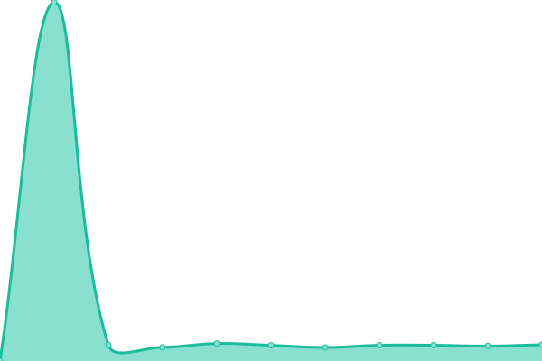
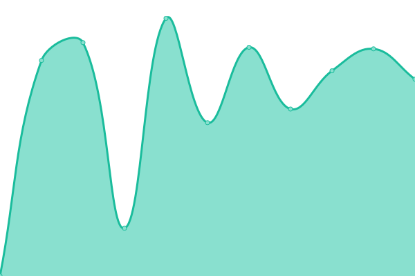
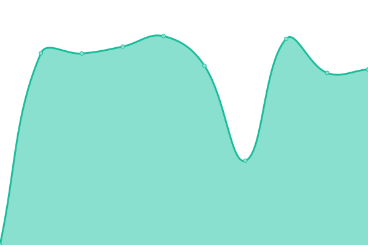
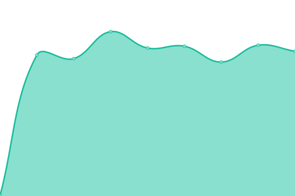
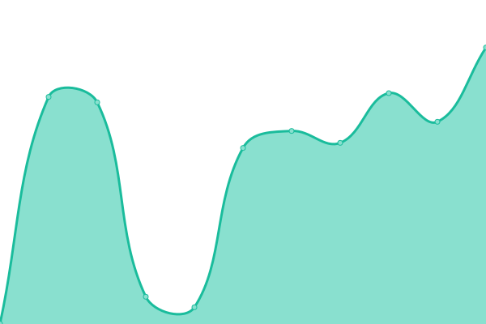
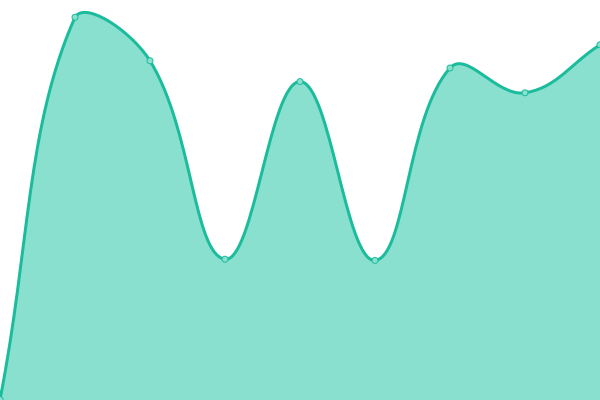

# [📈 Live Status](https://down.dgnr.us): <!--live status--> **🟩 All systems operational**

This repository contains the open-source uptime monitor and status page for [Astral](https://dgnr.us), powered by [Upptime](https://github.com/upptime/upptime).

With [Upptime](https://upptime.js.org), you can get your own unlimited and free uptime monitor and status page, powered entirely by a GitHub repository. We use [Issues](https://github.com/astrxldev/uptime/issues) as incident reports, [Actions](https://github.com/astrxldev/uptime/actions) as uptime monitors, and [Pages](https://down.dgnr.us) for the status page.

<!--start: status pages-->
<!-- This summary is generated by Upptime (https://github.com/upptime/upptime) -->
<!-- Do not edit this manually, your changes will be overwritten -->
<!-- prettier-ignore -->
| URL | Status | History | Response Time | Uptime |
| --- | ------ | ------- | ------------- | ------ |
|  [Domain: dgnr.us](https://dgnr.us) | 🟩 Up | [domain-dgnr-us.yml](https://github.com/astrxldev/uptime/commits/HEAD/history/domain-dgnr-us.yml) | 

 209ms
     
 | 

<a href="https://down.dgnr.us/history/domain-dgnr-us">100.00%</a>
    

|  [Gitea](https://git.dgnr.us) | 🟩 Up | [gitea.yml](https://github.com/astrxldev/uptime/commits/HEAD/history/gitea.yml) | 

 718ms
     
 | 

<a href="https://down.dgnr.us/history/gitea">83.67%</a>
    

|  [CDN](https://cdn.dgnr.us) | 🟩 Up | [cdn.yml](https://github.com/astrxldev/uptime/commits/HEAD/history/cdn.yml) | 

 890ms
     
 | 

<a href="https://down.dgnr.us/history/cdn">100.00%</a>
    

|  [Proxy](https://www-prox.dgnr.us) | 🟩 Up | [proxy.yml](https://github.com/astrxldev/uptime/commits/HEAD/history/proxy.yml) | 

 1219ms
     
 | 

<a href="https://down.dgnr.us/history/proxy">99.67%</a>
    

|  [Domain: gunshiz.top](https://gunshiz.top) | 🟩 Up | [domain-gunshiz-top.yml](https://github.com/astrxldev/uptime/commits/HEAD/history/domain-gunshiz-top.yml) | 

 1578ms
     
 | 

<a href="https://down.dgnr.us/history/domain-gunshiz-top">100.00%</a>
    

|  [Domain: sudloh.com](https://sudloh.com) | 🟩 Up | [domain-sudloh-com.yml](https://github.com/astrxldev/uptime/commits/HEAD/history/domain-sudloh-com.yml) | 

 941ms
     
 | 

<a href="https://down.dgnr.us/history/domain-sudloh-com">100.00%</a>
    

|  [Buzz Events Website](https://buzz.sudloh.com/api/artifact/count) | 🟩 Up | [buzz-events-website.yml](https://github.com/astrxldev/uptime/commits/HEAD/history/buzz-events-website.yml) | 

 916ms
     
 | 

<a href="https://down.dgnr.us/history/buzz-events-website">100.00%</a>
    

|  [Domain: sastify.xyz](https://sastify.xyz) | 🟩 Up | [domain-sastify-xyz.yml](https://github.com/astrxldev/uptime/commits/HEAD/history/domain-sastify-xyz.yml) | 

 953ms
     
 | 

<a href="https://down.dgnr.us/history/domain-sastify-xyz">100.00%</a>
    

|  [Server: Mega](http://m.dgnr.us) | 🟩 Up | [server-mega.yml](https://github.com/astrxldev/uptime/commits/HEAD/history/server-mega.yml) | 

 475ms
     
 | 

<a href="https://down.dgnr.us/history/server-mega">100.00%</a>
    

|  [Server: Micro 1](https://spotbk1.dgnr.us) | 🟩 Up | [server-micro-1.yml](https://github.com/astrxldev/uptime/commits/HEAD/history/server-micro-1.yml) | 

 881ms
     
 | 

<a href="https://down.dgnr.us/history/server-micro-1">100.00%</a>
    

|  [Server: Micro 2](https://status.dgnr.us) | 🟩 Up | [server-micro-2.yml](https://github.com/astrxldev/uptime/commits/HEAD/history/server-micro-2.yml) | 

 994ms
     
 | 

<a href="https://down.dgnr.us/history/server-micro-2">100.00%</a>
    

|  [Server: Mini](https://cloud.dgnr.us) | 🟩 Up | [server-mini.yml](https://github.com/astrxldev/uptime/commits/HEAD/history/server-mini.yml) | 

 675ms
     
 | 

<a href="https://down.dgnr.us/history/server-mini">83.67%</a>
    

|  [Database](https://buzz.sudloh.com/api/artifact/count) | 🟩 Up | [database.yml](https://github.com/astrxldev/uptime/commits/HEAD/history/database.yml) | 

 593ms
     
 | 

<a href="https://down.dgnr.us/history/database">100.00%</a>
    

<!--end: status pages-->

[**Visit our status website →**](https://down.dgnr.us)

## 📄 License

- Powered by: [Upptime](https://github.com/upptime/upptime)
- Code: [MIT](./LICENSE) © [Anand Chowdhary](https://anandchowdhary.com), supported by [Pabio](https://pabio.com)
- Data in the `./history` directory: [Open Database License](https://opendatacommons.org/licenses/odbl/1-0/)
